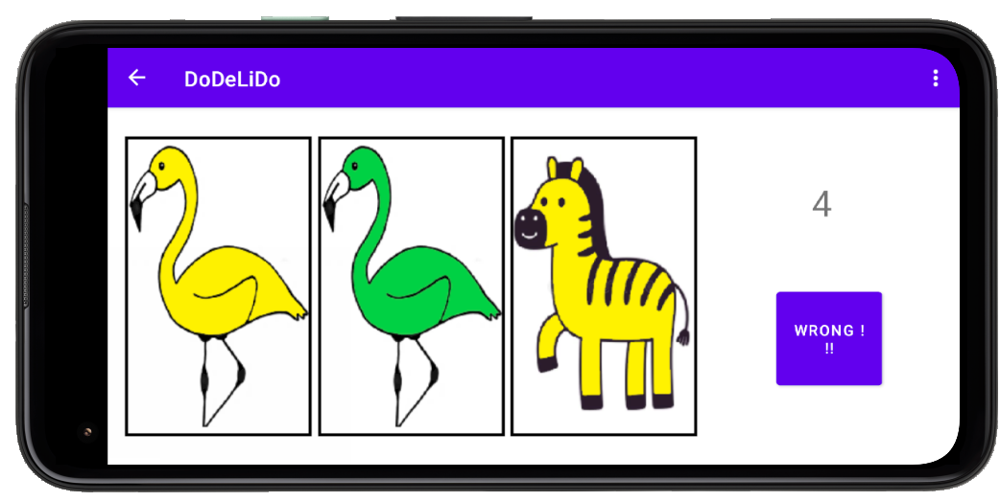

# Dodelido card game

Dodelido is an Android app with a Java backend, based on the correspondent card game. It is just
required on a single Android mobile phone or tablet to be enjoyed by the whole family or with friends.

----

## Background
This backend and the respective frontend for the android app was developed as the final assignment of the ZHAW course CAS object-oriented programming FS2021.
We, the three students Kaltrim Bajrami, Lukas Boril, and Nadine Duss were complete novices in object-oriented programming. With this first project
we managed to improve our Java and Kotlin skills as well as got to know Git and the Spring framework. If you have any feedback or
suggestions for improvement we are very happy to hear from you by mail or pull request.

## Installation

The source code for the frontend in [Kotlin](https://github.zhaw.ch/dussnad1/group4-Dodelido-Frontend/) and the backend in [Java](https://github.zhaw.ch/dussnad1/group4-Dodelido-Backend) is available on Git.

## Usage

The game consists of  25 card types depicting 5 different animals in 5 colours. The rules are simple: 3 cards are shown to the player on the move and he has to immediately shout out the most occurring trait (colour or animal)
If two traits are present to the equal highest number, then "Dodelido" has to be called out. If the player gives a wrong or too late answer (i.e. after the countdown reaches 0), the other players have 5
seconds to press the wrong button (0 to -5 on the timer). When the wrong button is pressed
the player who made the mistake will lose valuable health points. The longer no mistake was made the more points he will lose!
One additional twist: as tortoises are slow animals, you have to add a "ehm" before the answer for each visible tortoise (e.g. "ehm blue").
The solution for the depicted case is "Dodelido!".




``` java
public String haveFun (Game dodelido) {
download();
install();
return "ready"; }
```

## Contributing
Pull requests are welcome. For major changes, please open an issue first to discuss what you would like to change.

## License
[MIT](https://choosealicense.com/licenses/mit/)


